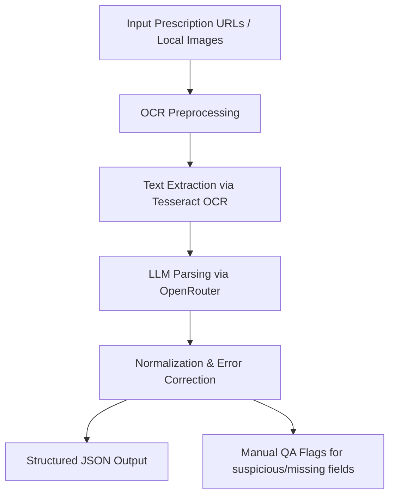

# 🏥 Prescription Parser

A **Python tool** to extract **structured patient and prescription information** from **handwritten or printed doctor prescriptions**. Supports **images (JPG/PNG)** and **multi-page PDFs**.


---

## 🚀 Features

* ✅ Supports **JPG, PNG, and PDF** prescriptions
* ✅ OCR preprocessing for **enhanced text recognition**
* ✅ Intelligent parsing with **LLM via OpenRouter**
* ✅ Normalizes **drug names** while preserving suffixes (XR, DS, Plus, etc.)
* ✅ Handles **common OCR errors** and abbreviations (OD, BD, TDS, QID, SOS, PRN, STAT)
* ✅ Produces **clean, structured JSON output**
* ✅ Flags **suspicious or missing fields** for manual QA

---

## 📦 Installation & Requirements

### Python Dependencies

```bash
pip install pytesseract pillow requests pdf2image demjson3
```

### System Dependencies

* **Tesseract OCR** (must be installed & added to PATH)
* **Poppler** (required for PDF → image conversion)

#### Ubuntu/Debian:

```bash
sudo apt update
sudo apt install tesseract-ocr poppler-utils
```

#### macOS:

```bash
brew install tesseract poppler
```

#### Windows:

* [Tesseract OCR](https://github.com/UB-Mannheim/tesseract/wiki)
* [Poppler for Windows](http://blog.alivate.com.au/poppler-windows/)

---

## ⚙️ Configuration

Edit these values in `prescription_parser.py`:

```python
OPENROUTER_API_KEY = ""   # Your OpenRouter API key
MODEL_NAME = "google/gemini-2.5-flash"
INPUT_FILE = "prescriptions.json"
OUTPUT_FILE = "extracted_prescriptions.json"
IMAGES_FOLDER = "images"  # Folder for local prescription files
```

> You must obtain an API key from [OpenRouter](https://openrouter.ai/) to use this tool.

---

## 📂 Input Format

`prescriptions.json` should be a list of objects containing prescription URLs:

```json
[
  { "url": "https://example.com/prescription1.jpg" },
  { "url": "https://example.com/prescription2.pdf" }
]
```

Local files in the `images` folder will also be processed automatically.

---

## 🖼️ Workflow



**Steps Explained:**

1. **Input**: Prescriptions in JSON or local folder
2. **OCR Preprocessing**: Enhance contrast & sharpness for better text extraction
3. **Tesseract OCR**: Convert images/PDF pages into text
4. **LLM Parsing**: Extract structured fields (patient info, medicines, vitals, diagnostics)
5. **Normalization & Error Correction**: Correct OCR mistakes, expand medical abbreviations, standardize formats
6. **Output**: JSON file with `Manual_QA_Flags` for review

---

## 📊 Example Output

```json
{
  "prescription_number": 1,
  "source": "https://example.com/prescription1.jpg",
  "parsed_output": {
    "Patient_Name": {"Value": "Ram", "Confidence": "high"},
    "Age": 25,
    "Sex": "M",
    "Prescription_Date": "2025-09-14",
    "Vitals": {
      "Weight": null,
      "Height": null,
      "Temperature": null,
      "SpO2": null,
      "BP": "130/80",
      "Pulse_Rate": null
    },
    "Medicines": [
      {
        "Drug_Name": {"Value": "Nexito 5 mg", "Confidence": "high"},
        "Dosage": "1 tab",
        "Frequency": "Once daily",
        "Duration": "30 days",
        "Notes": null
      }
    ],
    "Diagnostic_Tests": ["Blood Sugar", "Lipid Profile"],
    "Doctor_Name": "Dr. Sanjay Kumar",
    "Specialization": "Physician",
    "Confidence_Level": {"Overall": "high", "Reason": null},
    "Manual_QA_Flags": []
  }
}
```

---

## ▶️ Usage

```bash
python prescription_parser.py
```

* Processes **URLs in `prescriptions.json`**
* Processes **local files** in the `images` folder
* Outputs structured JSON to `extracted_prescriptions.json`

---

## 🐛 Troubleshooting

1. **Tesseract not found**

   * Ensure Tesseract OCR is installed and in PATH
   * On Windows, specify path in code:

   ```python
   pytesseract.pytesseract.tesseract_cmd = r'C:\Program Files\Tesseract-OCR\tesseract.exe'
   ```

2. **PDF conversion errors**

   * Verify Poppler installation and PATH

3. **OpenRouter API errors**

   * Check your API key and internet connectivity

---

## 🤝 Contributing

1. Fork the repository
2. Create your branch (`git checkout -b feature/AmazingFeature`)
3. Commit changes (`git commit -m 'Add AmazingFeature'`)
4. Push branch (`git push origin feature/AmazingFeature`)
5. Open a Pull Request

---

## 📝 License

MIT License — see [LICENSE](LICENSE)

---

## 🙏 Acknowledgments

* [Tesseract OCR](https://github.com/tesseract-ocr/tesseract)
* [OpenRouter](https://openrouter.ai/)
* [pdf2image](https://github.com/Belval/pdf2image)
* [Pillow](https://python-pillow.org/)

